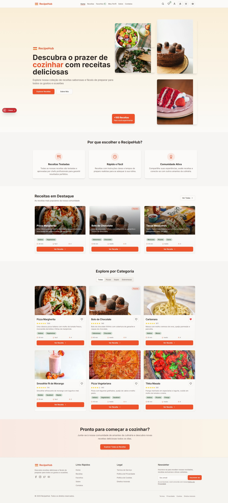
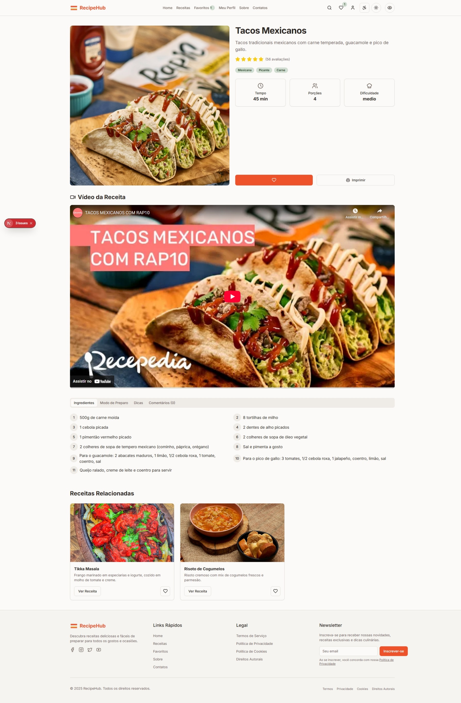
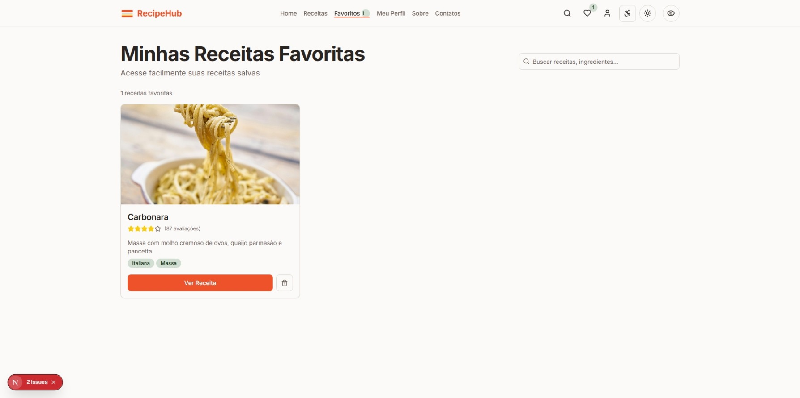
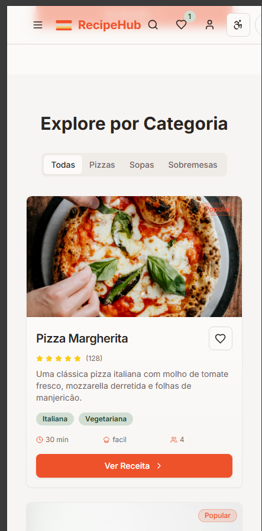

# 🍳 RecipeHub

### Projeto Final - Disciplina de UX - Arquitetura e Usabilidade

RecipeHub é uma plataforma moderna e intuitiva para descobrir, compartilhar e organizar receitas culinárias. Desenvolvido como projeto final da disciplina de UX - Arquitetura e Usabilidade, o projeto foca na experiência do usuário e em uma interface limpa e funcional.

---

## 📸 Screenshots

### 🏠 Homepage


### 📄 Página da Receita


### ⭐ Favoritos


### 📱 Mobile View

---

## 🎯 Objetivos do Projeto

✅ Criar uma experiência de usuário intuitiva e agradável  
✅ Implementar design responsivo para diferentes dispositivos  
✅ Desenvolver uma interface moderna seguindo princípios de UX/UI  
✅ Facilitar a descoberta e organização de receitas  

---

## ✨ Funcionalidades

### 🔍 Descoberta de Receitas

- 🏷️ Navegação por categorias (Sobremesas, Pratos Principais, Saladas, etc.)
- 🔎 Sistema de busca avançada
- 🎛️ Filtros por dificuldade, tempo de preparo e tipo de dieta
- ⭐ Receitas em destaque na página inicial

### 📱 Interface Responsiva

- 💻 Design adaptável para desktop, tablet e mobile
- 👆 Navegação otimizada para touch
- ⚡ Carregamento rápido e performance otimizada

### ⭐ Sistema de Favoritos

- 💾 Salvar receitas favoritas localmente
- 🚀 Acesso rápido às receitas preferidas
- 🔄 Persistência de dados entre sessões

### 🎥 Conteúdo Multimídia

- 📺 Integração com vídeos do YouTube
- 🖼️ Imagens de alta qualidade para cada receita
- ▶️ Player de vídeo integrado

### 💬 Interação Social

- 💭 Sistema de comentários nas receitas
- ⭐ Avaliações com estrelas
- 🤝 Compartilhamento de experiências

### 🖨️ Funcionalidades Extras

- 🖨️ Modo de impressão otimizado
- 💾 Armazenamento local de preferências

---

## 🛠️ Tecnologias Utilizadas

| Categoria    | Tecnologia           |
| ------------ | -------------------- |
| Framework    | Next.js 14           |
| Linguagem    | TypeScript / JavaScript|
| Estilização  | Tailwind CSS         |
| Componentes  | shadcn/ui            |
| Ícones       | Lucide React         |
| Build        | Node.js e npm        |

---

## 🎨 Decisões de Design (UX/UI)

### 🎨 Paleta de Cores

- **Primária:** Verde `#22c55e` – representa frescor e ingredientes naturais
- **Secundária:** Tons neutros para legibilidade
- **Acentos:** Laranja para CTAs e elementos interativos

### 🔤 Tipografia

- **Fonte principal:** Inter – moderna, legível e web-friendly
- **Hierarquia:** Clara com tamanhos bem definidos
- **Contraste:** Adequado para acessibilidade

### 📐 Layout

- **Grid System:** Responsivo e flexível
- **Cards:** Design limpo com informações essenciais
- **Navegação:** Intuitiva com breadcrumbs e menu claro

### 👤 Experiência do Usuário

- Fluxo de navegação simplificado
- Feedback visual em todas as interações
- Estados de loading e mensagens de erro
- Microinterações para melhor engajamento

---

## 🚀 Como Executar o Projeto

### 📋 Pré-requisitos

- Node.js (versão 18 ou superior)
- npm ou yarn

### ⚙️ Instalação

Clone o repositório:

```bash
git clone https://github.com/gstvgms/recipehub-ux-project
cd recipehub
```

Instale as dependências:

```bash
npm install --legacy-peer-deps
```

Execute o projeto:

```bash
npm run dev
```

Acesse no navegador:

```
http://localhost:3000
```

---

## 📁 Estrutura do Projeto

```
RecipeHubV2/
├── 📂 components/          # Componentes reutilizáveis
│   ├── 📂 ui/             # Componentes base (shadcn/ui)
│   ├── 📄 site-header.jsx # Cabeçalho do site
│   ├── 📄 site-footer.jsx # Rodapé
│   └── ...
├── 📂 data/               # Dados estáticos das receitas
│   └── 📄 recipes.js      # Base de dados das receitas
├── 📂 hooks/              # Custom hooks
├── 📂 pages/              # Páginas do Next.js
├── 📂 public/             # Arquivos estáticos
├── 📂 styles/             # Estilos globais
└── 📂 docs/               # Screenshots e documentação
```

---

## 🎓 Aspectos Acadêmicos

### 📚 Metodologia UX Aplicada

- **Research:** Análise de plataformas similares
- **Personas:** Definição do público-alvo
- **User Journey:** Mapeamento da jornada do usuário
- **Wireframes:** Prototipagem de baixa fidelidade
- **Mockups:** Design final de alta fidelidade

### 🎨 Princípios de UI Design

- **Consistência:** Padrões visuais uniformes
- **Hierarquia:** Organização clara da informação
- **Affordance:** Elementos intuitivos e reconhecíveis
- **Feedback:** Resposta visual às ações do usuário
- **Acessibilidade:** Contraste e navegabilidade adequados

### 🔍 Usabilidade

- **Eficiência:** Tarefas realizadas rapidamente
- **Eficácia:** Objetivos alcançados com sucesso
- **Satisfação:** Interface agradável e envolvente
- **Aprendizagem:** Curva de aprendizado baixa

---

## 📊 Métricas e Resultados

| Métrica        | Resultado                                    |
| -------------- | ------------------------------------------- |
| Performance    | Carregamento otimizado das imagens          |
| Responsividade | Funciona em dispositivos de 320px a 1920px+ |
| Acessibilidade | Contraste adequado e navegação por teclado  |
| SEO            | Estrutura semântica e meta tags otimizadas |

---

## 🔄 Funcionalidades Futuras

- 🔐 Autenticação de usuários
- 📤 Sistema de upload de receitas
- 🍎 Integração com API de nutrição
- 📱 Compartilhamento social
- 🛒 Lista de compras automática
- 📅 Planejador de refeições

---

## 👨‍💻 Autor

**Gustavo Gomes**

📚 Curso: Análise e Desenvolvimento de Sistemas  
🎓 Disciplina: UX - Arquitetura e Usabilidade  
👨‍🏫 Professor: Carlos Alberto  
📅 Período: 5º período  

---

## 📄 Licença

Este projeto foi desenvolvido para fins acadêmicos como parte do projeto final da disciplina de **UX - Arquitetura e Usabilidade**.

---

<div align="center">

🍳 **RecipeHub - Transformando a experiência culinária através do design centrado no usuário.**

_(Screenshots disponíveis na pasta `/docs`)_

</div>
